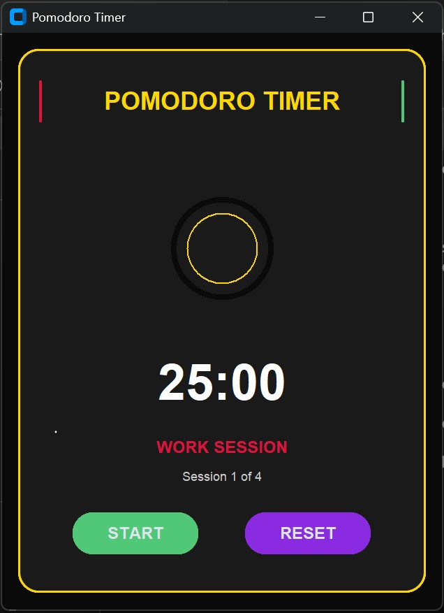

# ⏳ Pomodoro Timer v1

A stylish **Pomodoro Timer app** built using
[CustomTkinter](https://github.com/TomSchimansky/CustomTkinter).\
This timer helps you stay productive by alternating between **work
sessions** and **breaks**, following the Pomodoro technique.

------------------------------------------------------------------------

## 🚀 Features

-   🎨 Modern dark-themed UI with accent colors\
-   ⏱️ Work, Short Break, and Long Break cycles\
-   🔄 Automatic session switching\
-   ▶️ Start, Pause/Resume, and Reset functionality\
-   📊 Circular progress indicator\
-   🖥️ Cross-platform (Windows, macOS, Linux)

------------------------------------------------------------------------

## 📂 Repository Structure

    pomodoro-Clock-v1/
    │
    ├── pomodoro.py              # Main script
    ├── requirements.txt         # Dependencies
    ├── README.md                # Documentation
    └── assets/                  # Screenshot

------------------------------------------------------------------------

## ⚡ Installation

1.  Clone this repository:

    ``` bash
    git clone https://github.com/your-username/Pomodoro-Clock-v1.git
    cd Pomodoro-Clock-v1
    ```

2.  Install dependencies:

    ``` bash
    pip install -r requirements.txt
    ```

3.  Run the app:

    ``` bash
    python pomodoro_v1.py
    ```

------------------------------------------------------------------------

## 🖼️ Screenshot

Here's a demo screenshot of the final UI



------------------------------------------------------------------------

## 🛠️ Tech Stack

-   Python 3
-   [CustomTkinter](https://github.com/TomSchimansky/CustomTkinter)

------------------------------------------------------------------------

## 📜 License

This project is licensed under the MIT License -- see the
[LICENSE](LICENSE) file for details.

------------------------------------------------------------------------

## ❤️ Contributing

Feel free to fork the repo, open issues, or submit pull requests!

------------------------------------------------------------------------

## 📌 Future Improvements

-   Add customizable session lengths via UI\
-   Add Spotify/YouTube Plugin
-   Improve the look and feel of UI/UX
-   Add sound notifications\
-   Add statistics/history tracking

## Final Message

-  This is a project with which I am improving my UI/UX skills.
-  This project is the first out of a total of 5 iterations.
-  Enjoy this build, and I will get back with a compact, aesthetic, and better version.
